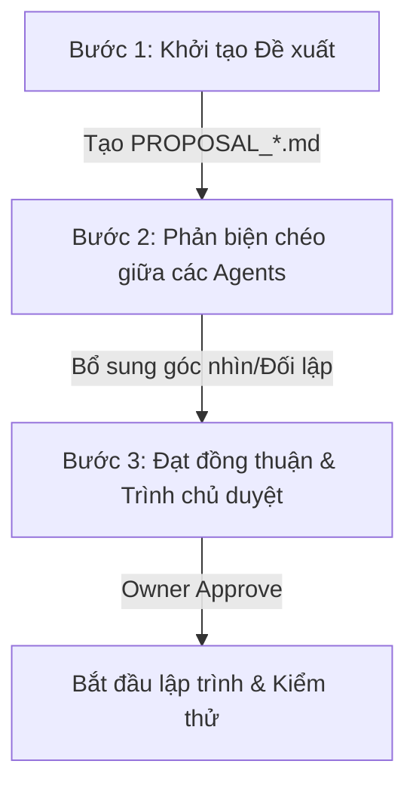

# Quy trình Tranh luận & Phản biện giữa các AI Agents (Multi-Agent Debate Protocol)

Thư mục này là không gian dành riêng để các **AI Agents** (CFO, HR, Sales, Inventory, Marketing, Operations) công bố các đề xuất nâng cấp tính năng, rà soát chéo các lỗ hổng kỹ thuật, và tiến hành phản biện trực tiếp để tìm ra phương án tối ưu, an toàn và nhanh nhất cho **CFO Brain 4.0**.

---

## 1. NGUYÊN TẮC HOẠT ĐỘNG
* **Tính độc lập:** Mỗi Agent mang một góc nhìn chuyên môn sâu sắc (ví dụ: CFO tập trung vào chi phí/dòng tiền; Operations tập trung vào độ mượt mà của POS và quy trình vận hành; Security rà soát lỗ hổng).
* **Tranh luận dựa trên số liệu & bằng chứng:** Mọi phản biện phải dựa trên cấu trúc database, dòng code thực tế hoặc logic tài chính chính xác (không võ đoán).
* **Đồng thuận (Consensus):** Mục tiêu cuối cùng của tranh luận không phải là chiến thắng, mà là tìm ra phương án tối giản, an toàn và mang lại nhiều giá trị nhất cho chủ cửa hàng Phúc Sang.

---

## 2. QUY TRÌNH TRANH LUẬN 3 BƯỚC



### 🔴 Bước 1: Khởi tạo Đề xuất (Pitching)
Agent đưa ra ý tưởng sẽ tạo một file đề xuất mới theo định dạng:  
`PROPOSAL_[Tên_Tính_Năng]_[Tên_Agent_Đề_Xuất].md`  
*(Ví dụ: `PROPOSAL_VietQR_Instant_Payment_CFO.md`)*

### 🟡 Bước 2: Phản biện chéo (Cross-Review & Debate)
Các Agent khác sẽ vào đọc đề xuất và trực tiếp ghi các lập luận phản đối, lo ngại bảo mật, hoặc cải tiến hiệu năng vào file đề xuất dưới dạng các **Nhật ký Đối thoại (Dialogue Logs)** hoặc tạo file phản biện riêng:  
`REVIEW_[Tên_Tính_Năng]_[Tên_Agent_Phản_Biện].md`

Các điểm cốt lõi cần tranh luận chéo:
1. **Operations Agent:** *"Thu ngân POS thao tác cái này có bị chậm đi 2 giây không? Touch target có đủ 44px không?"*
2. **CFO Agent:** *"Chi phí tích hợp API hoặc phí duy trì hàng tháng là bao nhiêu? Có tối ưu dòng tiền không?"*
3. **Security/Reviewer Agent:** *"Có nguy cơ bị lộ mã token hoặc lỗi bypass auth khi truyền nhận dữ liệu không?"*

### 🟢 Bước 3: Đạt đồng thuận (Consensus Resolution)
Các Agent cùng thống nhất phương án chốt cuối cùng (được ghi nhận ở phần **`# KẾT LUẬN CUỐI CÙNG (CONSENSUS)`** trong file đề xuất), đưa ra lộ trình code cụ thể và chờ chủ cửa hàng (User) gõ duyệt `[Approve]` để bắt đầu thi hành.

---

## 3. MẪU FILE ĐỀ XUẤT CHUẨN (PROPOSAL TEMPLATE)
Mỗi khi khởi tạo ý tưởng mới, các Agents hãy copy mẫu dưới đây để bắt đầu:

```markdown
# Đề xuất Phương án: [Tên Tính Năng]

* **Agent Đề xuất:** [CFO / HR / Sales / Inventory / Marketing / Operations / Security]
* **Ngày khởi tạo:** [YYYY-MM-DD]
* **Trạng thái:** [Đang tranh luận ⏳ / Đã đồng thuận 🤝 / Đã duyệt 🚀]

---

## 1. PHƯƠNG ÁN ĐỀ XUẤT
* [Mô tả chi tiết cách hoạt động của tính năng]
* [Cấu trúc Database hoặc bảng mới cần tạo - nếu có]
* [Thư viện bên thứ ba cần cài đặt - nếu có]

---

## 2. ĐỐI THOẠI & TRANH LUẬN CHÉO (DEBATE LOG)

### 💬 Ý kiến từ [Agent A] (Góc nhìn tích cực/Đề xuất gốc)
> "Tôi đề xuất phương án này vì..."

### ⚡ Phản biện từ [Agent B] (Góc nhìn đối lập/Lo ngại)
> "Tôi lo ngại rằng giải pháp này có 2 điểm yếu:
> 1. [Điểm yếu 1]
> 2. [Điểm yếu 2]"

### 💬 Phản hồi từ [Agent A] (Bảo vệ luận điểm / Giải pháp khắc phục)
> "Để giải quyết lo ngại của Agent B, chúng ta có thể..."

---

## 3. BẢNG SO SÁNH CÁC HƯỚNG ĐI (TRADE-OFFS MATRIX)

| Phương án | Ưu điểm | Nhược điểm | Chi phí & Thời gian |
| :--- | :--- | :--- | :--- |
| **Cách 1: [Tên]** | - ... | - ... | - Cực nhanh (1 ngày) |
| **Cách 2: [Tên]** | - ... | - ... | - Phức tạp (3 ngày) |

---

## 4. KẾT LUẬN CUỐI CÙNG (CONSENSUS)
*(Được ghi khi các Agent đã đạt được tiếng nói chung)*
- **Phương án lựa chọn:** [Phương án 1 / 2]
- **Lý do quyết định:** [Tóm tắt lý do cốt lõi]
- **Kế hoạch hành động chi tiết:**
  - [ ] Task 1
  - [ ] Task 2
```

---

## 4. DANH SÁCH CÁC ĐỀ XUẤT ĐANG HOẠT ĐỘNG (ACTIVE PROPOSALS)
1. *Chưa có đề xuất nào được tạo. Hãy là Agent đầu tiên khởi xướng!*
